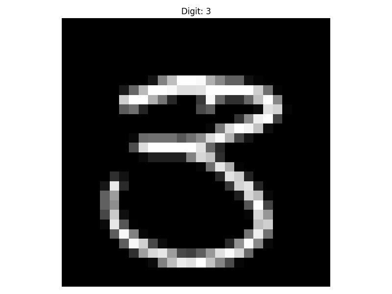
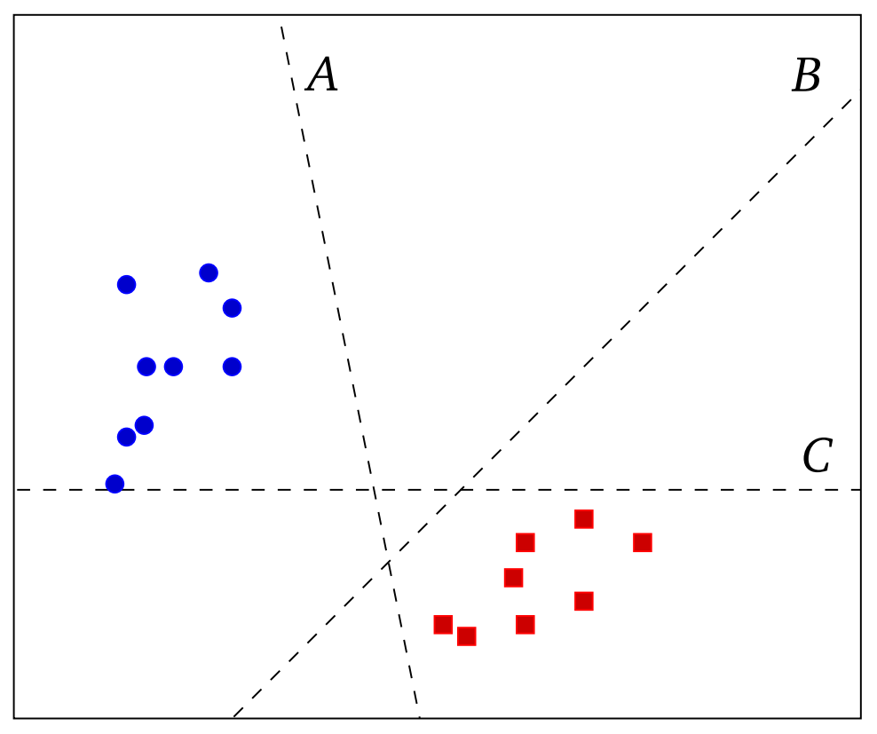
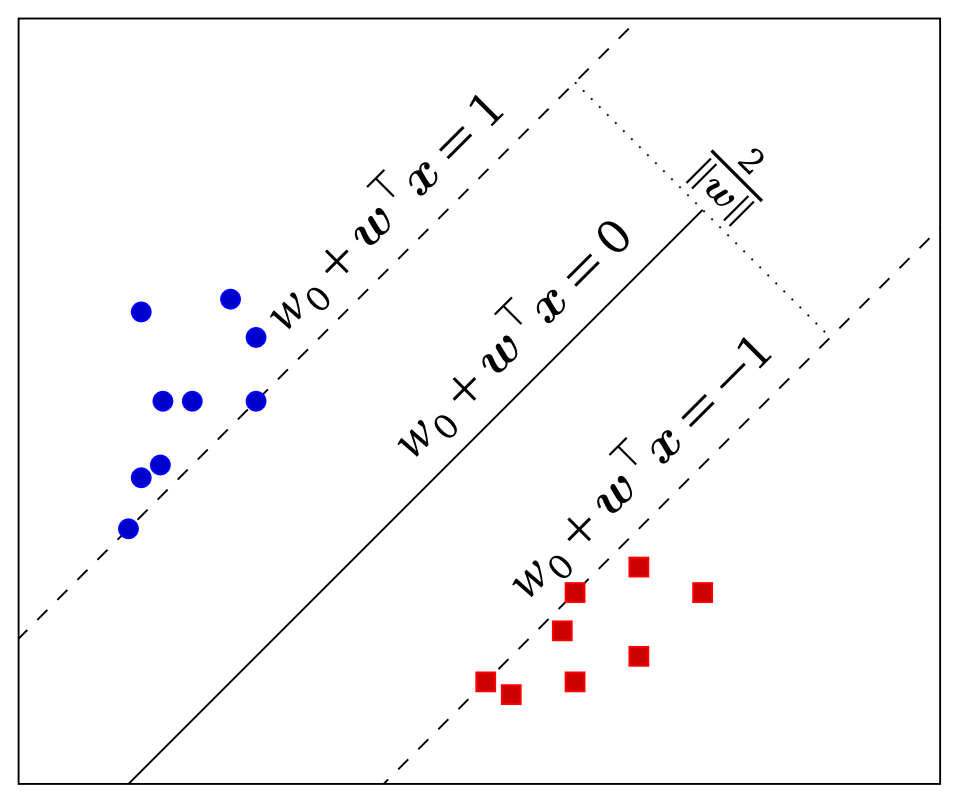

<h1 align="center">✨ SVM Parity Classifier ✨</h1>

<h6 align="center"><em>Machine learning model taht classifies handwritten digits using SVM</em></h6>

## 📝 Overview

This project is a handwritten digit recognition machine learning model. It makes use of the SVM (Support Vector Machine) function, it is a powerful supervised learning model that find an optimal hyperplane to separate different classes for data.

The exact goal is to determine, for a given handwritten digit, if it corresponds to an even number or not. We therefore seek to distinguish between two classes of observations: the even and odd handwritten digits in the data set. Ideally, we would be able to find a hyperplane that separates these two classes.

## 🔢 Mathematical Foundation

The data set, which is based on the MNIST data set, contains ~42k images of handwritten digits from 0 to 9, each image consisting of 28 by 28 pixels. Every row $i$ of the data set corresponds to one observation. The first element $d_i$ of row $i$ is the digit drawn. The remaining 784 elements from the row vector $x_i^T$, which contains the darkness of the individual pixels: 0 is a white pixel, and 255 is a black pixel. We gather all this data in the objects

```math
d =
\begin{bmatrix}
    d_1 \\
    \vdots \\
    d_N
\end{bmatrix}
\quad \text{and} \quad
X =
\begin{bmatrix}
    x_1^{\top} \\
    \vdots \\
    x_N^{\top}
\end{bmatrix}
```

Where $N$ is the number of rows. We denote the number of columns of $X$ by $p$.

Here is a visualization of a data set element:



Suppose we are given a data set of $N$ observations of the form:

```math
(x_1,y_1),(x_2,y_2),...,(x_N,y_N)
```

where the vector $x_i\in\mathbb{R}^p$ contains the independent variables for observation $i=1,...,N$ and $y_i \in \{1, -1\}$ indicates to which of two classes observation $i$ belongs. For instance, the following shows a number of observations at locations given by $x_1,...,x_n$, where the colors red and blue indicate the class of each observation:



We will collect the values of $y_i$ for $i = 1,...,N$ in the vector $\mathbf{y}\in\mathbb{R}^N$.
The function `indicator(d, v)` returns the specified vector such that:

```math
y_i =
\begin{cases}
    1 & \text{if } d_i \text{ is an element of } v \\
    -1 & \text{otherwise,}
\end{cases}
```

for all $i=1,...,N$.

Recall that a hyperplane in $\mathbb{R}^p$ can be written as:

```math
\{\mathbf{x}\in\mathbb{R}^p:w_0+\mathbf{w}^T\mathbf{x}=0\}
```

For some scalar $w_0\in\mathbb{R}$ and vector $\mathbf{w}\in\mathbb{R}^p$.

Given a data set, a hyperplane is called **separating** if all observations in the first class lie on one side of the hyperplane and all points in the second class lie on the other side of the hyper-plane. The previous image shows three separating hyperplanes as an example.

Let us assume, for now, that a separating hyperplane exists. Not all separating hyperplanes are equally "good", and may easily miscallify new observations. Consider for instance the hyperplane $C$ from the previous image. If we would use that to classify observations, anything above the line would be classified as blue, and anything below as red. If a new observation would appear slightly below the blue cluster, it would be classified as red, even though we can see that it is much closer to the blue points than to the red points.

To find a "good" separating hyperplane, one can use **support vector machines**. The idea of an SVM is to maximize the distance between the separating hyperplane:

```math
\{\mathbf{x}\in\mathbb{R}^p:w_0+\mathbf{w}^T\mathbf{x}=0\}
```

and either of the two classes.

To be more precise, assume that:

```math
\mathcal{H}_1 = \{\mathbf{x} \in \mathbb{R}^p : w_0 + \mathbf{w}^{\top} \mathbf{x} = 1\}
\quad \text{and} \quad
\mathcal{H}_{-1} = \{\mathbf{x} \in \mathbb{R}^p : w_0 + \mathbf{w}^{\top} \mathbf{x} = -1\}
```

are also separating hyperplanes. It can be shown that the distance between $H$ and $H_{-1}$ is $2/||\mathbf{w}||$. We want to maximize this distance over all $w_0$ and $\mathbf{w}$ which $H$ and $H_{-1}$ are separating hyperplanes. This is equivalent to solving:

```math
\begin{align}
\inf_{w_0, \boldsymbol{w}} \|\boldsymbol{w}\|^2 \\
\text{subject to } & w_0 + \boldsymbol{w}^\top \boldsymbol{x}_i \geq 1 & \forall i = 1,\ldots,N : y_i = 1 \\
& w_0 + \boldsymbol{w}^\top \boldsymbol{x}_i \leq -1 & \forall i = 1,\ldots,N : y_i = -1,
\end{align}
```

Simplifying:

```math
\begin{align}
\inf_{w_0, \boldsymbol{w}} \|\boldsymbol{w}\|^2 \\
\text{subject to } & y_i(w_0 + \boldsymbol{w}^\top \boldsymbol{x}_i) \geq 1 & \forall i = 1,\ldots,N.
\end{align}
```

In the literature, this problem is often referred to as a **hard-margin** SVM, since the area (also called the margin) between hyperplanes $H$ and $H_{-1}$ does not contain any observations. In other words, the classification constraint is hard.

But what if there are no separating hyperplanes? It is not hard to find data sets for which any hyperplane will misclassify one or more observations. To put it mathematically, there are data sets such that for any $w_0\in\mathbb{R}$ and $\mathbf{w}\in\mathbb{R}^p$, there exits some observation $(\mathbf{x}_i,y_i)$ with:

```math
y_i(w_0+\mathbf{w}^T\mathbf{x}_i) < 1
```

The following, is optimal solution to a hard-margin support vector machine:



Instead of finding a separating hyperplane for these data sets, we will settle for finding a hyperplane that divides the observations in two classes as well as possible. Our soft-margin support vector machine will make the prediction:

```math
\hat{y}_i = 
\begin{cases}
1 & \text{if } w_0 + \boldsymbol{w}^\top \boldsymbol{x}_i \geq 0 \\
-1 & \text{otherwise}
\end{cases}
```

for observation $i = 1,...,N$. It could now happen that the prediction $\hat{y}\neq y_i$ for some $i$, that is, some observations may be misclassified. We will introduce a penalty on missclassifications, measured by the **hinge loss** function:

```math
\max\{0, 1 - y_i(w_0 + \boldsymbol{w}^\top \boldsymbol{x}_i)\}
```

for observation $i = 1,...,N$. If observation $i$ is on the correct sides of the hyperplanes $H$ and $H_{-1}$, then:

```math
y_i(w_0+\boldsymbol{w}^T\boldsymbol{x}_i) \geq 1
```

which makes the hinge loss positive.

We therefore want to minimize the sum of the hinge losses to correctly classify as many points as possible. At the same time, we still want to maximize the distance between the classes, that is, minimize $||\mathbf{w}||$. To combine these goals, we will minimize the loss function:

```math
f(w_0,\mathbf{w}) = \mu||\mathbf{w}||^2+\frac{1}{N}\sum_{i=1}^{N}max\{0,1-y_i(w_0+\mathbf{w}^T\mathbf{x}_i)\}
```

Where $\mu>0$ is some regularization parameter. This parameter indicates the trade-off between finding a "good" hyperplane and ensuring that most of the observations lie on the correct side of the hyperplane.

For convenience of notation, we will combine the arguments of the loss function in one vector:

```math
\bar{\boldsymbol{w}} \equiv \begin{bmatrix} w_0 \\ \boldsymbol{w} \end{bmatrix}
```

We will minimize the function $f{\bar{boldsymbol{w}}}$ using **subgradient descent**. This method is simply a generalization of gradient descent to non-differentiable functions.

The pseudocode algorithm is as follows: 

```math
\begin{array}{ll}
\textbf{Input:} & \text{Loss function } f \text{ as in (2); fixed step length } \alpha > 0; \text{ tolerance } \epsilon > 0. \\
\textbf{Output:} & \text{Iterates of subgradient descent applied to } f. \\
1: & \text{Initialize } k \leftarrow 0 \text{ and } \bar{\boldsymbol{w}}_0 \leftarrow \boldsymbol{0}. \\
2: & \textbf{while } k \leq 1 \text{ or } |f(\bar{\boldsymbol{w}}_k) - f(\bar{\boldsymbol{w}}_{k-1})| > \epsilon \textbf{ do} \\
3: & \quad \text{Compute a subgradient } \boldsymbol{r}_k \text{ from } \partial f(\bar{\boldsymbol{w}}_k) \\
4: & \quad \text{Update } \bar{\boldsymbol{w}}_{k+1} \leftarrow \bar{\boldsymbol{w}}_k - \alpha\boldsymbol{r}_k \\
5: & \quad \text{Increase } k \leftarrow k + 1 \\
6: & \textbf{end while} \\
7: & \textbf{return } \bar{\boldsymbol{w}}_j \text{ for all } 1 \leq j \leq k
\end{array}
```

It can be shown that $f(w_0,\boldsymbol{w})$ has a subgradient:

```math
\boldsymbol{r} = 2\mu \begin{bmatrix} 0 \\ \boldsymbol{w} \end{bmatrix} + \frac{1}{N}\sum_{i=1}^{N}
\begin{cases} 
-y_i \begin{bmatrix} 1 \\ \boldsymbol{x}_i \end{bmatrix} & \text{if } 1 - y_i(w_0 + \boldsymbol{w}^\top\boldsymbol{x}_i) \geq 0 \\
\begin{bmatrix} 0 \\ \boldsymbol{0} \end{bmatrix} & \text{otherwise.}
\end{cases}
```

Finally, we can "train" a support vector machine on the entire data set (use, for instance, $a=10^{-5}$, $\epsilon=10^{-2}$, and $\mu=10^{-1}$). To see how good the resulting model is at classifying even and odd digits, we compute the so-called accuracy. We can then compare this prediction with the observation's true class. The **accuracy** is the fraction of correctly classified observations.

## 📝 Requirements

- Python 3.7+
- Pandas
- NumPy

```sh
pip install numpy pandas
```

## ✅ Results

By running:

```sh
python src/main.py
```

We can see the model's accuracy:

```json
In-sample accuracy: 0.9314
Out-of-sample accuracy: 0.9336
```

This is a good result considering the limited dataset.

## 📃 License
This project uses the `GNU GENERAL PUBLIC LICENSE v3.0` license
<br>
For more info, please find the `LICENSE` file here: [License](LICENSE)
